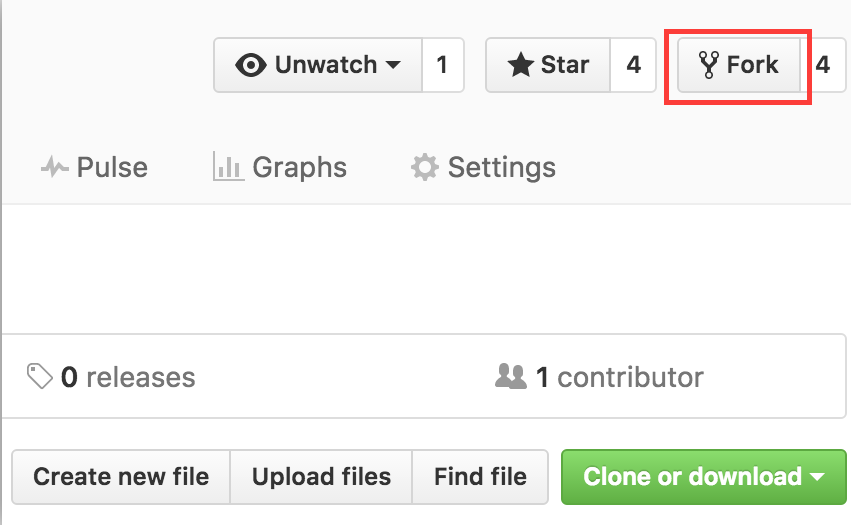
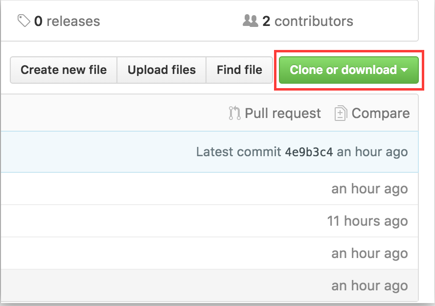
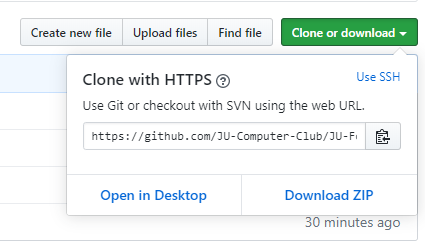
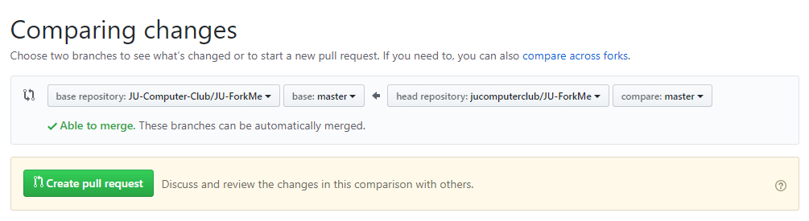
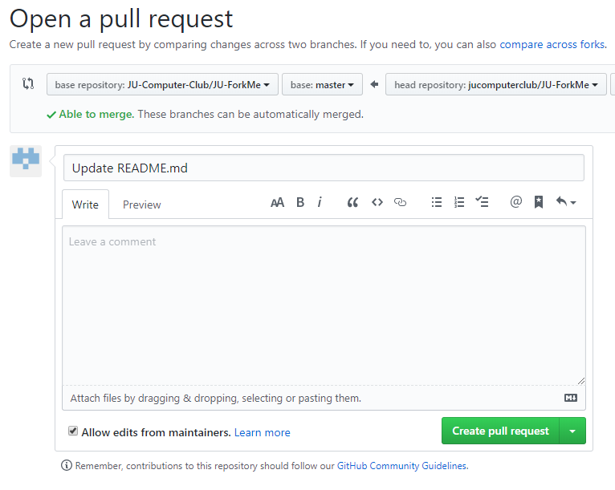

# Welcome to JU-ForkMe
## **JU-ForkMe** helps you to make your first step on *open source contribution.*
Contribute to this project, make a *Pull Request* add see your profile card displayed here!

# Contributors 

| **NAME**           | **PROFILE**                                                                                   |
|--------------------|-----------------------------------------------------------------------------------------------|
| JU Computer Club | [Click me](Contributors/example.md) |
| Meraj al Maksud | [Click me](Contributors/example2.md) |

#  Contributing Guideline

Follow these steps to make your first pull request:

1. First Fork this repository in your github account.



2. Clone your forked repository to your local machine.



3. Edit the necessary changes to the files

4. Next you need to push your local repo to your github repo. Write these commands on your terminal:

    ```
    git add -A
    git commit -m "your name"
    git push origin master
    ```
    
5. Then create your first *Pull Request*.



6. Now review and submit the pull request. Make sure to add necessary information in the description.



7. Star this repository! :star:

8. Congratulations! Your pull request has been successfully created!

9. Email us at info@jucomputerclub.org to and wait till we review and merge your changes!

10. You can follow our socials mentioned at the *Credits sections*.


# Credits
Brought to you by **JU Computer Club** from **Jahangirnagar University**<br>
Like us on [](https://www.facebook.com/jucomputerclub) and follow on [](https://twitter.com/JUComputerClub)<br>
